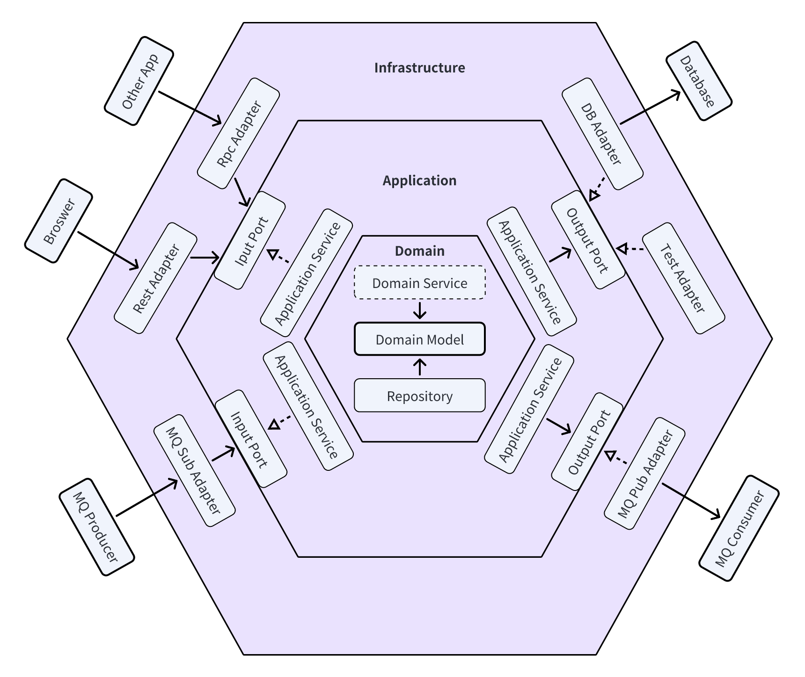
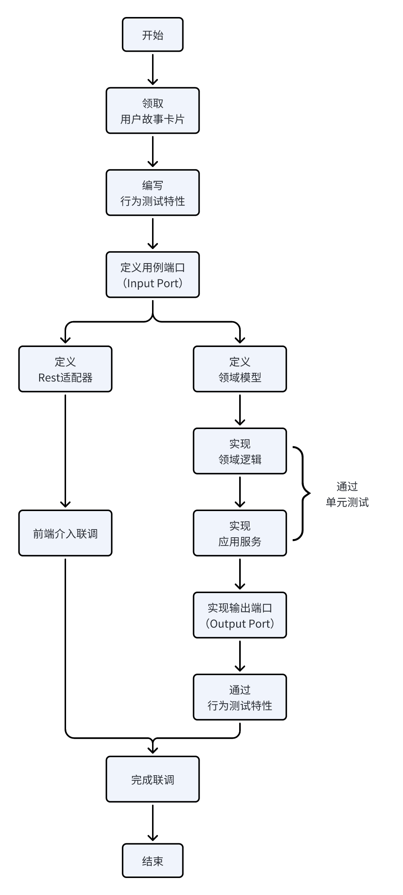

# Python DDD in practise
## 六边形架构
六边形架构，也叫端口-适配器架构，应用面向接口编程设计原则，通过端口、适配器将核心业务逻辑和基础设施解耦；六边形架构应用由内向外整体分为三层：领域层、应用层和基础设施层，示意图如下：

### 领域层
领域层包含了完整的业务逻辑，是领域模型以及领域逻辑所在地，处于整个应用的核心，也是整个应用中最具业务价值的部分。按照DDD战术设计原则，领域内部核心包含领域模型、资源库以及可选的领域服务。

- 领域模型：具体又有聚合根、实体、值对象、领域事件等划分；
- 资源库：以聚合根为对象操作领域模型的读写；
- 领域服务：当一个内聚的业务逻辑横跨多个领域时，通过领域服务来进行抽象，应该尽量减少领域服务的使用；

**领域层不依赖任何外部层**。

### 应用层
应用层包含了应用完整的外部表现，即外部感知到的应用行为（包括输入和输出），是“端口-适配器”中“端口”定义所在的层，从行为角度，可以将端口分为输入端口（也叫驱动端口，driving ports）和输出端口（也叫被驱动端口，driven ports）：
- 输入端口：定义应用的输入接口，每个输入接口应用对应一个或多个业务用例，所以输入接口也被称为用例接口，**输入端口由应用服务实现，被基础设施层适配器使用**。
- 输出端口：采用依赖反转的方式，由应用层定义外部输出接口，避免了对基础设施细节的依赖。**输出端口由基础设施层的适配器实现，被应用服务使用**。
- 应用服务：是输入端口的实现者，也是业务规则的编排者，应用服务调用领域模型执行领域逻辑，调用资源库持久化领域模型，此外如数据库事务等也在应用服务中实现。

**应用层只依赖领域层**。

### 基础设施层
基础设施层处理应用提供服务需要，但又不属于业务规则的其他所有支撑性事务，包含应用配置、“端口-适配器”中的适配器实现、依赖注入容器实现等，其中适配器根据行为不同分为输入适配器和输出适配器：
- 输入适配器：实现特定协议（如HTTP、RPC、MQ）接收输入，然后通过输入端口实现业务调用；
- 输出适配器：使用特定协议（如数据库、文件、MQ）实现输出端口供应用调用；
- 依赖注入：管理各个服务之间的依赖关系，自动注入依赖属性；

## 开发流程



### 领取用户故事卡片
推荐使用*用户故事*方法，将需求描述、需求跟踪与任务分配相结合，在用户故事看板认领故事点后，可以对应到开发流程。

### 编写行为测试特性
以`features/piggy_bank.feature`为例:
```gherkin
Feature: 用小猪储蓄罐存钱
  你有一个小猪储蓄罐，可以往里面存钱。

  Scenario: 查看储蓄罐余额
    Given 储蓄罐里现在有5元
    When 我查看储蓄罐余额
    Then 储蓄罐余额是5元

  Scenario: 往储蓄罐存1元钱
    Given 储蓄罐里现在有10元
    When 我往储蓄罐里存入1元钱
    Then 储蓄罐余额是11元
```
一般来说，行为测试特性对应用户故事卡片，测试场景对应用户故事卡片的任务拆解，通过编写行为测试用例，可以重新对需求进行一遍梳理，同时也对”任务完成“进行了定义，明确了预期结果。

### 定义用例端口
用例端口，即输入端口，以`application/ports/input/piggy_bank_use_case.py`为例：
```python
from abc import ABC
from abc import abstractmethod


class CheckPiggyBankUseCase(ABC):

    @abstractmethod
    def balance(self):
        """Check balance of the piggy bank.

        Returns:
            float: balance of the piggy bank balance.
        """
        pass


class SavePiggyBankUseCase(ABC):

    @abstractmethod
    def deposit(self, amount):
        """Put money into the piggy bank.

        Args:
             amount: money to put
        Returns:
            bool: success or failed
        """
        pass
```
用例端口根据用例场景编写，是纯接口定义，用于描述应用的外部行为。基础设施层的各种适配器通过用例接口来与应用交互，用例接口由应用服务来实现。

## References
1. [Taskfile official usage guide](https://taskfile.dev/usage/).
2. [Managing conda environments](https://conda.io/projects/conda/en/latest/user-guide/tasks/manage-environments.html).
3. [10 Minute Tutorial of BDD](https://cucumber.io/docs/guides/10-minute-tutorial/?lang=java).
4. [Tutorial of behave](https://behave.readthedocs.io/en/latest/tutorial/).
5. [Tutorial of fastapi](https://fastapi.tiangolo.com/tutorial/).
6. [Dependency Injector examples](https://python-dependency-injector.ets-labs.org/examples/index.html).
